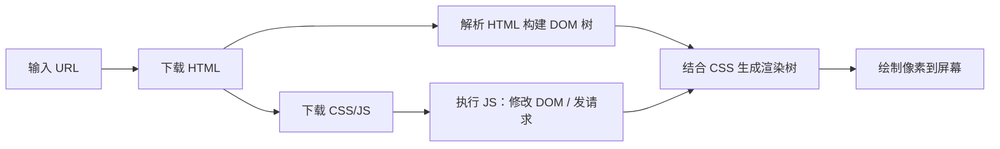

# 第 1 章 · 前端世界观与三件套地图

> 🎯 **本章目标**：建立对前端世界的整体认知——浏览器里到底发生了什么？HTML/CSS/JS 各自负责什么？JS 和 Java 有哪些"让你 uncomfortable"的差异？**本章不要求你记住全部细节**，它是一张地图，后面的章节会带你把每个区域走一遍。

**前置知识**：无。有 Java 后端经验即可。

---

## 1. 前端和后端的根本区别

| 维度 | 后端（Java） | 前端（浏览器） |
|---|---|---|
| 运行位置 | 你自己的服务器（JVM） | **用户的浏览器**里 |
| 代码部署 | 打成 jar 包，跑在 Tomcat | 静态文件（html/js/css）由 Nginx/CDN 下发 |
| 用户 | 只有你控制的那台机器 | 成千上万种屏幕、浏览器版本 |
| 状态 | 数据库 + 内存 + Redis | 内存（组件状态）+ localStorage + 一小段 URL |
| 出错后果 | 日志里排查 | 用户眼前白屏，还截图发群里 |

> ☕ **Java 视角**：后端是"许多请求排队进一个 JVM"，前端是"一个用户独享一个页面进程"。前端代码跑在**别人的电脑**上，所以有两大后端没有的约束：**加载要快**（每 KB 都是用户流量）和**兼容性**（用户浏览器你控制不了）。

### 一个最容易被后端误解的点

**前端没有"请求-响应"的控制器模式。** 用户点一下按钮，不是发个请求等响应，而是：事件触发 → JS 执行 → **立刻修改页面上的某些数据 → 页面自动更新**。现代前端框架（Vue/React）的全部使命，就是把"改数据"和"页面自动更新"这件事做好。

---

## 2. 浏览器加载页面时发生了什么



三个关键词：

- **DOM**：浏览器把 HTML 解析成的"对象树"。JS 能读写它——`document.querySelector('.title')` 就是"查库"（查的是 DOM 这棵树）。
- **渲染**：CSS 决定每个 DOM 节点画在哪、长什么样。
- **事件**：click、input、submit……浏览器是"事件驱动"的，这和后端的"请求驱动"是两种世界观。

> 🔧 **动手**：在任意网页按 `F12` 打开开发者工具（DevTools）。`Elements` 面板就是 DOM 树，你可以直接改文字看效果；`Console` 面板是 JS 的 REPL，敲 `document.title` 回车。**DevTools 是前端最重要的调试工具，相当于后端的日志 + 断点 + curl 合体。**

---

## 3. HTML：页面的骨架（10 分钟版）

HTML 不是编程语言，是**标记语言**——用一对对标签描述"这是标题、这是列表、这是输入框"。

```html
<!-- 一个标准的 HTML5 骨架，见本项目 index.html -->
<!DOCTYPE html>
<html lang="zh-CN">
  <head>
    <meta charset="UTF-8" />
    <title>页面标题（浏览器标签页）</title>
  </head>
  <body>
    <h1>一级标题</h1>
    <p>段落。 <strong>加粗</strong> 和 <em>倾斜</em>。</p>
    <a href="https://example.com">超链接</a>
    

    <ul>
      <li>无序列表项</li>
    </ul>

    <!-- 表单：后端程序员最该认识的 HTML 元素 -->
    <form>
      <input type="text" placeholder="文本框" />
      <input type="password" placeholder="密码框" />
      <input type="checkbox" /> 勾选框
      <input type="radio" name="s" /> 单选
      <select><option>下拉框</option></select>
      <textarea>多行文本</textarea>
      <button type="submit">提交按钮</button>
    </form>
  </body>
</html>
```

**重点：语义化**。用 `<header>` `<nav>` `<main>` `<section>` `<footer>` `<table>` 这些"有含义"的标签，而不是全部用 `<div>`。好处：SEO、无障碍阅读、代码可读。

> 🔍 **结合本项目**：`index.html` 是整个应用的唯一 HTML 文件——`<div id="app"></div>` 只有一个节点，所有页面都是 JS 往这个节点里"画"出来的。这种应用叫 **SPA（单页应用）**，第 7 章的路由会解释"为什么只有一个 HTML 也能有多个 URL"。

---

## 4. CSS：页面的皮肤（概念版，实战在第 11 章）

CSS 的基本句式：**选择器 + 属性**。

```css
/* 选择器 { 属性: 值; } */
.card {                    /* class 选择器（最常用） */
  padding: 20px;           /* 内边距 */
  border-radius: 6px;      /* 圆角 */
  color: #303133;          /* 文字颜色 */
}

#app .btn-primary:hover {  /* 组合 + 伪类：id=app 里 class 含 btn-primary 的元素，鼠标悬停时 */
  background: #409eff;
}
```

三个必须建立的概念：

1. **盒模型**：每个元素是一个盒子，从内到外 `content → padding → border → margin`。本项目在 `styles/main.css` 里全局设置了 `box-sizing: border-box`（宽度计算包含 padding 和 border，前端事实标准）。
2. **层叠与优先级**：同名样式会"打架"，谁赢看优先级（行内 > id > class > 标签；后写的赢同优先级的）。所以 Vue 提供了 `scoped` 样式来避免打架（第 11 章）。
3. **布局靠 Flex/Grid**：现代前端不写浮动和绝对定位表格布局。`display: flex` 一行代码就能做"左右布局"，本项目侧边栏布局就是它（第 11 章细讲）。

---

## 5. JavaScript：和 Java 的"貌合神离"

名字带 Java 但和 Java 关系 ≈雷锋和雷峰塔。**核心差异表**（建议精读两遍）：

| 特性 | Java | JavaScript |
|---|---|---|
| 类型系统 | 静态类型，编译期检查 | **动态类型**，运行时才知道（`typeof x`） |
| 类型转换 | 编译器把关（唯一能"自动"跨类型的运算符是 `+` 拼接） | 隐式转换：`+` 见到字符串就拼接（`1 + '1'` 得 `'11'`，不是 2）；`-` 只懂数字，把字符串转成数字（`'1' - 1` 得 0）。转换方向随运算符变，规则极难记 |
| 并发 | 多线程 + 锁 | **单线程 + 事件循环**（不会死锁，但有回调地狱） |
| 等值比较 | `equals()` | `===` 严格比较类型和值。`==` 比较前会先做隐式转换（`1 == '1'` 为 true），极易埋雷，所以**永远用 ===** 不用 `==` |
| null 空间 | `null` | `null`（人为置空）**和** `undefined`（压根没赋值）两个 |
| 面向对象 | class 是一等公民 | 函数是一等公民，class 是语法糖 |
| 模块 | package/import | ESM 的 `import` / `export`（见 5.3） |
| 运行环境 | JVM | 浏览器（JS 引擎）/ Node.js |

### 5.1 ES6+ 语法速查（对着敲一遍，10 分钟）

```javascript
// ---- 变量：永远用 const，需要重新赋值才用 let（没有 var 的生存空间） ----
const name = '张三'        // 常量（引用不可变）
let count = 0              // 变量

// ---- 模板字符串：≈ Java 的 String.format，但更顺手 ----
const msg = `用户 ${name} 有 ${count} 条消息`

// ---- 箭头函数：≈ lambda 表达式 ----
const add = (a, b) => a + b                    // 等价 function(a, b) { return a + b }
const users = [{ name: 'A', age: 18 }, { name: 'B', age: 30 }]

// ---- 数组三件套：map/filter/reduce（≈ Stream API） ----
users.map(u => u.name)                    // ['A', 'B']        ≈ stream().map()
users.filter(u => u.age > 20)             // [{ name: 'B' }]   ≈ stream().filter()
users.reduce((sum, u) => sum + u.age, 0)  // 48                ≈ stream().reduce()

// ---- 解构：从对象/数组里"按名取值" ----
const { name, age } = users[0]             // ≈ 一次性提取两个字段
const [first, second] = ['x', 'y']         // 数组解构
function show({ name, age = 20 } = {}) {}  // 参数解构 + 默认值

// ---- 展开运算符：创建"修改后的副本"（前端数据更新的灵魂） ----
const updated = { ...users[0], age: 19 }   // 新对象，不改原对象
const newList = [...users, { name: 'C' }]  // 新数组，追加元素

// ---- 可选链 + 空值合并（≈ Java 的 Optional，但内建） ----
const city = user?.address?.city ?? '未知' // user 为 null 也不会 NPE，null/undefined 时取默认值

// ---- 三元与短路 ----
const tag = age >= 18 ? '成年' : '未成年'
isLoggedIn && refreshData()                // 为 true 才执行
```

### 5.2 异步：Promise 与 async/await（⭐ 前后端思维最大的分水岭）

JS 是**单线程**的，不能像 Java 一样"开个线程等数据库响应"。所有耗时操作（网络请求、定时器）都是**异步**的：发起后不阻塞，完成后通过事件队列回调。

```javascript
// 回调风格（老式，容易"回调地狱"）
getUser(id, (user) => { getOrders(user, (orders) => { /* ... */ }) })

// Promise 链（中间态）
getUser(id).then(user => getOrders(user)).then(orders => render(orders)).catch(showError)

// async/await（现代标准，看起来像同步代码，本质还是异步）⭐
async function loadOrders(id) {
  try {
    const user = await getUser(id)        // await = "等这个 Promise 完成，但不卡死线程"
    const orders = await getOrders(user)
    return orders
  } catch (error) {
    showError(error)                       // ≈ try/catch，异常能穿透 await
  }
}
```

> ☕ **Java 视角**：`Promise<T>` ≈ `CompletableFuture<T>`，`await` ≈ `thenApply/thenCompose` 的语法糖。区别：Java 的 main 线程会等你 join，**JS 的调用方永远不会等**——`async` 函数的返回值一定是 Promise，忘了 `await` 就拿到一个"还没发生"的 Promise，这是前端第一大坑。

### 5.3 模块系统（ESM）

```javascript
// utils/format.ts —— 一个模块可以 export 多个"具名"成员 + 一个默认成员
export function formatDateTime(iso: string): string { /* ... */ }
export default mockAdapter   // 默认导出：一个模块只能有一个

// 别的文件里导入
import { formatDateTime } from '@/utils/format'   // 具名导入（名字要一致）
import mockAdapter from '@/mock/adapter'          // 默认导入（名字随便起）
import * as userApi from '@/api/user'             // 整体导入成命名空间
```

> ☕ **Java 视角**：`import com.foo.Bar` 是"声明全限定名"；JS 的 `import` 是**真正把代码拿进来**（打包器按图索骥），且路径要写对——`@/utils/format` 里的 `@` 是本项目在 `vite.config.ts` 里配置的别名，代表 `src` 目录。

---

## 6. 三件套 → 框架：为什么需要 Vue

三件套直接写应用（原生 JS 操作 DOM）有什么问题？看一个伪需求：列表里删掉一项，然后：

```javascript
// 原生写法：手动找到 DOM 节点 → 删除 → 手动更新计数 → 手动更新空状态……
const item = document.querySelector(`#item-${id}`)
item?.remove()
document.querySelector('#count')!.textContent = String(newCount)
if (newCount === 0) document.querySelector('#empty')!.style.display = 'block'
```

状态散落在 DOM 里，每处都要手动同步，迟早改崩。**Vue 的答案：数据是唯一事实源，DOM 是数据的投影**——你只改数据（`users.value = newList`），DOM 自动更新。这就是"响应式"，第 5 章深入。

---

## 7. 学习资源地图（遇到问题查哪里）

- **MDN**（`developer.mozilla.org`）：HTML/CSS/JS 的"官方字典"，中文可用。查 API 先查它。
- **Vue 官方文档**（`cn.vuejs.org`）：质量极高，把本教程读完后应通读一遍。
- **浏览器 DevTools**：`F12`，_ELEMENTS/Console/Network_ 三个面板够用 90% 场景。`Network` 面板能看每个请求的报文——后端同学用 curl 看的，在这里看。

---

## ✏️ 动手练习

1. **DevTools 热身**：打开任意网页，在 Console 执行 `document.body.style.filter = 'grayscale(1)'`，观察页面变灰（再刷新还原）。
2. **语法手感**：不查资料，写出：① 一个解构对象并给默认值的语句；② 把字符串数组转大写的 map；③ 一个 async 函数依次 await 两个 Promise。
3. **找不同**：说出 `==` 和 `===` 的区别，并解释为什么本项目代码里找不到 `==`。

<details><summary>练习提示</summary>

① `function greet({ name = '游客' } = {}) { return `你好，${name}` }` ② `arr.map(s => s.toUpperCase())` ③ `==` 会做隐式类型转换（`1 == '1'` 为 true），`===` 严格比较类型和值；类型转换的隐式规则极难记，团队规范一律 `===`。

</details>

## 📌 本章小结

- 前端跑在用户浏览器里，事件驱动、单线程、无法控制环境。
- HTML 是骨架（语义化），CSS 是皮肤（盒模型/Flex/Grid），JS 是行为（异步是核心心智）。
- `Promise`/`async-await` ≈ `CompletableFuture`，但**永远记得 await**。
- 框架解决的核心问题：**数据与 DOM 的自动同步**。

**下一章** → [02-project-setup.md](./02-project-setup.md)：把工程跑起来，认识 npm 和 Vite。
