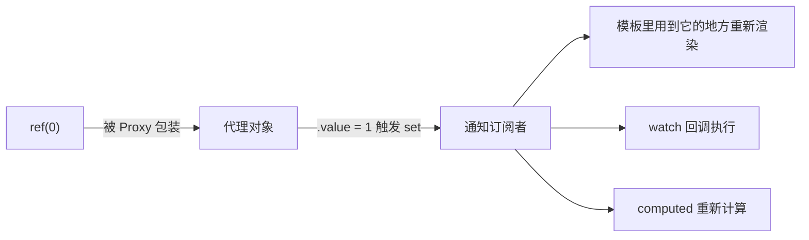
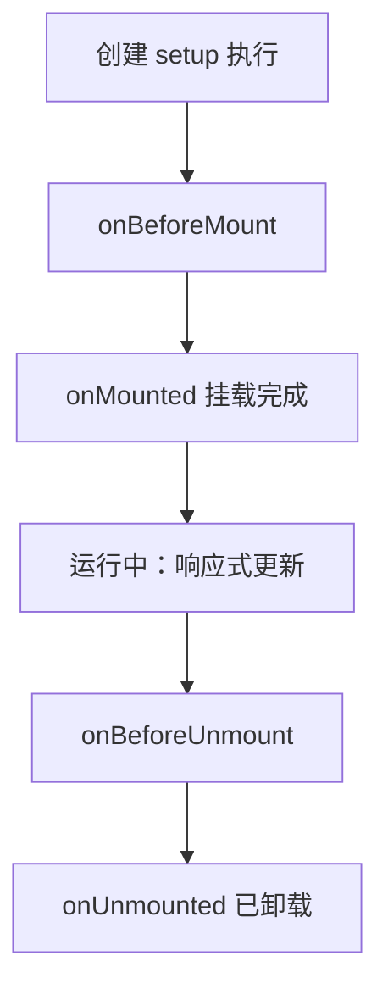

# 第 5 章 · 响应式与组合式 API（Composition API）

> 🎯 **本章目标**：理解 Vue 的灵魂——**响应式系统**（为什么改个变量页面会变），掌握 `<script setup>` 的四大件：`ref` / `computed` / `watch` / 生命周期钩子。

**前置知识**：第 4 章。

---

## 1. 响应式：Vue 的"魔法"到底是什么

第 1 章说过：原生 JS 改数据，页面不会变；Vue 改数据，页面自动变。原理一句话：

**Vue 用 `Proxy`（ES6 代理对象）把你的数据包了一层，任何读写都会被"感知"：读的时候记录谁在用（依赖收集），写的时候通知所有用它的地方重新渲染（派发更新）。**



> ☕ **Java 视角**：这就是 **Spring AOP 动态代理**的思想——你拿到的不是原对象，是行为被增强过的代理。区别在于 Spring 的代理增强的是"方法调用"（事务、日志），Vue 的代理增强的是"属性读写"（依赖追踪）。Hibernage 的脏检查、MyBatis 的延迟加载代理，思想上都是一家人。

---

## 2. ref：响应式的默认选择

```typescript
import { ref } from 'vue'

const count = ref(0)          // 创建：包装成响应式"容器"
count.value++                 // ⚠️ script 里读写必须 .value（容器本身不变，变的是内容）
console.log(count.value)      // 1
```

```vue
<template>
  <p>{{ count }}</p>          <!-- ✅ 模板里不用 .value（顶层 ref 自动解包） -->
  <button @click="count++">+1</button>
</template>
```

**为什么要有 `.value`？** 因为 JS 无法拦截"普通变量的赋值"（Java 也一样），只能拦截对象的属性读写。`ref` 把值装进对象的 `.value` 属性，Proxy 才有下手的地方。**"script 里忘写 .value" 是新手第一大错误，编辑器会标灰提示。**

可以装任何东西，包括对象、数组、甚至后端返回的整个分页结果：

```typescript
// 本项目 src/views/UsersView.vue
const users = ref<UserAccount[]>([])        // 状态声明 = 类型 + 初值
users.value = result.list                   // 整个替换：模板里的表格自动重渲染
```

### ref vs reactive

```typescript
const form = reactive({ username: '', password: '' })   // reactive：只收对象
form.username = 'a'   // 直接点属性，不用 .value
```

| | `ref` | `reactive` |
|---|---|---|
| 可包装 | 任何值 | 仅对象/数组 |
| 访问 | `.value` | 直接属性 |
| 替换整体 | ✅ `x.value = 新对象` | ❌ 不能整体换（响应式丢失） |

> 💡 **本项目约定**：**默认用 ref**（简单、可整体替换、类型友好）；`reactive` 只用于"固定形状的表单对象"（如 `LoginView` 的 `form`、`UsersView` 的 `filters`）——这也是社区的主流习惯。

---

## 3. computed：派生数据（带缓存）

```typescript
// 本项目 src/stores/user.ts
const isLoggedIn = computed(() => token.value !== '')

// 本项目 src/views/DashboardView.vue：从原始统计派生卡片数据
const statCards = computed<StatCardItem[]>(() => {
  if (!stats.value) return []
  return [
    { label: '用户总数', value: formatNumber(stats.value.totalUsers), /* ... */ },
    // ...
  ]
})
```

三个特性：

1. **缓存**：依赖不变时，重复访问不重算（≈ Spring `@Cacheable`，key 是"依赖了哪些 ref"）；
2. **自动追踪依赖**：不用声明依赖谁，回调里用了谁它就知道谁；
3. **只读**：不该在 computed 里改状态——它是"视图"不是"动作"。

> ⚠️ **新手坑**：把 `computed(() => stats.value)` 的结果取出来存到普通变量，就断了响应（拿到的是当时那一刻的快照）。要让"跟着变"，就一直通过 `.value` / 在模板里访问它。

> ☕ **Java 视角**：computed ≈ **数据库的视图（VIEW）/ 派生字段**：源表更新，视图自动新；而且有缓存，不像 getter 方法每次都算。

---

## 4. watch：监听变化执行副作用

`computed` 管"派生"，`watch` 管"副作用"——数据变了，去做一件**不产生新数据**的事（调接口、写 localStorage、弹提示）：

```typescript
// 本项目 src/views/ProfileView.vue：成功提示 3 秒后自动消失
watch(successMessage, (message) => {
  if (message === '') return
  if (hideTimer !== undefined) window.clearTimeout(hideTimer)
  hideTimer = window.setTimeout(() => (successMessage.value = ''), 3000)
})

// 监听 props 的变化（本项目 components/UserFormDialog.vue）：
// 每次弹窗"打开"时重置/回填表单
watch(
  () => props.open,          // 数据源可以是 getter 函数
  (open) => { if (open) /* 初始化表单 */ },
  { immediate: true },       // 选项：创建时立即执行一次
)
```

常用选项：`{ immediate: true }` 立即执行、`{ deep: true }` 深度监听对象内部变化。

**watchEffect**：立即执行一次并自动追踪所有依赖，依赖变了整体重跑。适合"依赖多、逻辑一坨"的场景：

```typescript
watchEffect(() => {
  const token = userStore.token           // 用到了 token
  const keyword = filters.keyword         // 用到了 keyword
  if (token) fetchUsers()                 // 任一变化 → 重跑
})
```

> ☕ **Java 视角**：watch ≈ **领域事件监听器 `@EventListener`**：状态变化发布事件，监听器做反应。watchEffect ≈ "把整段逻辑声明成对 N 个配置项的响应"。

**用还是不用？** 原则：**能用 computed 就用 computed**（无副作用），watch 只留给真正的副作用（网络请求、定时器、DOM 操作）。Most of the time，"数据变了要重新调接口"是最典型的 watch 场景。

---

## 5. 生命周期：组件的一生



本项目在用的两个：

```typescript
// src/views/DashboardView.vue —— 进页面拉数据
onMounted(loadStats)          // ≈ @PostConstruct：DOM 就绪后执行

// src/views/ProfileView.vue —— 离开页面清理定时器
onUnmounted(() => {
  if (hideTimer !== undefined) window.clearTimeout(hideTimer)   // ≈ @PreDestroy
})
```

> ⚠️ **忘掉 @PreDestroy 是内存泄漏的重灾区**：`setInterval`、全局事件监听（`window.addEventListener`）、第三方图表实例，凡是在 `onMounted` 里"挂出去"的资源，都要在 `onUnmounted` 里收回来。组件会被反复创建销毁，每次泄漏一点，页面越来越卡。

**setup 的执行时机** = 组件创建（beforeMount 之前），所以 `useUserStore()`、`const { loading, run } = useLoading()` 这些顶层语句每个实例都会执行一次。

---

## 6. 组合式 API 的组织哲学

Options API（Vue2 风格）按"数据/methods/computed"分堆；**组合式 API 按"功能"聚合**——一个功能的数据、计算、监听、清理写在一起。本项目的 `DashboardView` 逻辑区就是按功能分块的：`状态 → 拉取函数 → onMounted → 派生`。

> ☕ **Java 视角**：Options API 像按"字段表/方法表"分文件的手写 Servlet；组合式 API 像按业务能力内聚的 Service 类。你熟悉的"高内聚"直觉在这里成立。

---

## 7. 🔍 结合本项目源码（本章精读材料）

| 文件 | 看什么 |
|---|---|
| `src/views/DashboardView.vue` | ⭐ ref + useLoading + onMounted + computed 泛型标注 + 三态渲染 |
| `src/views/ProfileView.vue` | watch + 定时器清理（onUnmounted）+ computed 读 store |
| `src/components/UserFormDialog.vue` | watch `() => props.open` + `immediate` + reactive 表单 |
| `src/stores/user.ts` | ref 状态 + computed getters 的 Pinia 组合（第 8 章展开） |
| `src/composables/useLoading.ts` | ref 的最小封装（下一章细讲） |
| `src/views/LoginView.vue` | reactive 表单 + 手写校验（`@blur` 触发） |

---

## ✏️ 动手练习

1. **暴露 .value 忘写问题**：把 `DashboardView` 的 `stats.value = await run(...)` 临时改成 `stats = await ...`，看编译器报什么错，再改回来。
2. **computed 练习**：在用户管理页加一个 computed：`const hasDisabled = computed(() => users.value.some(u => u.status === 0))`，模板里用它显示一句"存在禁用用户"。
3. **watch 练习**：给文章列表加"关键词防抖搜索"：`watch(filters, () => { /* 500ms 后请求 */ }, { deep: true })`——试试不用手写防抖库怎么实现（提示：`setTimeout + clearTimeout`，和本章定时器清理同一个套路）。

<details><summary>练习提示</summary>

3. 在 watch 回调里 `clearTimeout(timer); timer = setTimeout(fetchArticles, 500)`；`onUnmounted` 里也要 clearTimeout。

</details>

## 📌 本章小结

- 响应式 = Proxy 代理 + 依赖追踪 + 精准更新，≈ 前端版的 AOP。
- **script 里 `.value`，模板里不用**；默认 ref，表单用 reactive。
- computed 派生（带缓存、只读）；watch 副作用；能用 computed 先用 computed。
- `onMounted` 拉 data ≈ `@PostConstruct`；`onUnmounted` 清理 ≈ `@PreDestroy`，不做就是内存泄漏。

**下一章** → [06-components-communication.md](./06-components-communication.md)：组件之间怎么"说话"。
