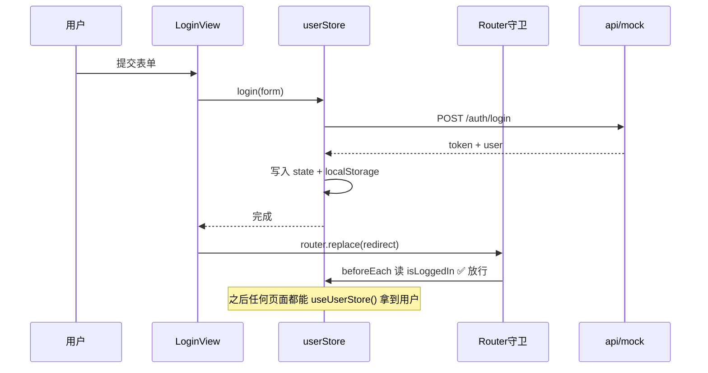

# 第 8 章 · 状态管理：Pinia

> 🎯 **本章目标**：理解"为什么需要全局状态"，掌握 Pinia 的 setup store 写法（state/getters/actions），以及一个绕不开的细节——`storeToRefs`。本项目用它管理**登录态**，这是任何管理系统的第一个全局状态。

**前置知识**：第 5-6 章。

---

## 1. 为什么需要"全局状态"

思考一个真实需求：**当前登录用户**（头像、昵称、角色）——

- 顶栏要显示昵称；
- 路由守卫要判断 `isLoggedIn`；
- 个人设置页要展示和修改它；
- 页面刷新后还不能丢。

如果用 props 一层层传：`App → Layout → TopBar`（2 层还行），业务多了以后 `App → A → B → C → D` 全程透传没人能维护。**答案：把"多组件共享的状态"放进一个独立于组件树的容器**。

> ☕ **Java 视角**：Pinia store ≈ **单例 `@Service` Bean**——容器里只有一份，谁需要注入谁，天然共享。组件 = 有生命周期的 Controller，store = 长驻的 Service。

Vue 官方方案演进：Vuex（Vue2 时代，模板代码多）→ **Pinia**（现官方推荐，TS 友好，API 就是组合式函数的样子）。

---

## 2. 定义 store：setup 写法

> 🔍 主教材：`src/stores/user.ts`（全文精读）。骨架：

```typescript
export const useUserStore = defineStore('user', () => {
  // ---------- state：响应式字段 ----------
  const token = ref<string>(getStorage(TOKEN_KEY, ''))
  const userInfo = ref<UserAccount | null>(getStorage<UserAccount | null>(USER_KEY, null))

  // ---------- getters：派生值（computed） ----------
  const isLoggedIn = computed(() => token.value !== '')
  const isAdmin = computed(() => userInfo.value?.role === 'admin')

  // ---------- actions：业务方法（同步异步都行） ----------
  async function login(params: LoginParams): Promise<void> {
    const result = await userApi.login(params)
    token.value = result.token
    userInfo.value = result.user
    setStorage(TOKEN_KEY, result.token)     // 持久化：刷新页面不丢
    setStorage(USER_KEY, result.user)
  }

  async function logout(): Promise<void> {
    try { await userApi.logout() }
    finally { clearSession() }              // 无论接口成败，本地状态必须清干净
  }

  return { token, userInfo, isLoggedIn, isAdmin, login, logout, /* ... */ }
})
```

和组件的 `<script setup>` 长得一模一样——**组合式函数的进阶用法**：`ref` 当字段、`computed` 当 getter、函数当 action。没有 Vuex 时代的 mutation 概念，**直接改 state 就是合法的**（但我们约定：有业务语义的修改走 action，和"领域方法封装业务规则"一个道理）。

**store id**（`'user'`）：DevTools 调试时显示的名字，全局唯一即可。

---

## 3. 使用 store：两种读法一个坑

```typescript
import { useUserStore } from '@/stores/user'

// ① 整个 store 当响应式对象用（推荐起步姿势）
const userStore = useUserStore()
userStore.userInfo?.nickname          // 读
userStore.login(form)                 // 调 action

// ② 模板/计算属性里读字段——直接访问即响应式
//   （本项目 components/AdminTopBar.vue）
const nickname = computed(() => userStore.userInfo?.nickname ?? '未登录')
```

**⚠️ 大坑：解构丢响应式**

```typescript
const { token, isLoggedIn } = userStore        // ❌ 解构 = 拷贝了"当时那一刻"的值，之后不再更新
const { token, isLoggedIn } = storeToRefs(userStore)   // ✅ 每个字段重新包成 ref，响应式保留
```

> 原理回想第 5 章：解构普通对象会"断开"响应式连接（和 props 解构丢响应同理）。`storeToRefs` 只还原 state/getter（action 是函数，不需要）。**要么不解构，要么 storeToRefs，二选一。**

> ☕ **Java 视角**：解构 ≈ 把 Bean 字段**按值拷贝**一份出来用——单例的意义就没了。`storeToRefs` ≈ 拿到的还是原字段的"引用"。

---

## 4. 本项目的登录态全景图（综合演练）



| 消费方 | 文件 | 用了什么 |
|---|---|---|
| 路由守卫 | `router/index.ts` | `isLoggedIn` 判断放行/拦截 |
| 顶栏 | `components/AdminTopBar.vue` | `userInfo` 显示昵称、`logout()` 登出 |
| 个人设置 | `views/ProfileView.vue` | `userInfo` 回填表单、`fetchProfile()` 回写 |
| 请求层 | `api/http.ts` | （读 localStorage 的 token，与 store 各管一摊，见第 9 章讨论） |

> 💡 **留意一个设计细节**：请求拦截器读的是 **localStorage** 而不是 store——因为模块加载顺序上 `http.ts` 不依赖任何 Vue 运行时，且刷新后 store 初始化也来自 localStorage。**token 的权威存储在 localStorage，store 是它的内存投影**，二者通过 `setStorage`/`getStorage` 同步。多一个思考角度，你就明白"状态放哪"没有标准答案，只有清晰的数据流。

---

## 5. Pinia vs 其他选择（选型直觉）

| 方案 | 适用 | 本项目态度 |
|---|---|---|
| 组件内 ref/reactive | 状态只有一个组件用 | 默认选择 |
| props/emits | 父子间明确的数据流 | 层级 ≤ 2 |
| provide/inject | 跨层"环境性"数据（主题/当前用户） | 主题切换在用 |
| **Pinia store** | **多页面共享 + 有业务动作** | 登录态 |
| 模块级单例 composable | 轻量全局（一两处） | useTheme 在用（教学演示） |

**规律**：范围越大、动作越复杂，越往 store 走。本项目刻意保留了 provide/inject 和单例 composable 两种"轻量替代品"，就是为了让你对比着学。

---

## 6. 🔍 结合本项目源码（本章精读材料）

| 文件 | 看什么 |
|---|---|
| `src/stores/user.ts` | ⭐ 全文精读：setup store 三件套 + localStorage 持久化 + finally 清理 |
| `src/main.ts` | `app.use(createPinia())` 必须在路由守卫能用 store 之前注册 |
| `src/components/AdminTopBar.vue` | 读 store + `computed` 包一层（不解构）的正确姿势 |
| `src/router/index.ts` | 守卫内 `useUserStore()`（不在模块顶层调用，避免 Pinia 未装好） |
| `src/composables/useTheme.ts` | 对照：模块级单例 composable 实现的"迷你全局状态" |

---

## ✏️ 动手练习

1. **加一个 getter**：在 userStore 里加 `displayName = computed(() => userInfo.value?.nickname || userInfo.value?.username || '游客')`，让顶栏改用它（体会 getter 的"兜底链"写法）。
2. **体验解构坑**：把 AdminTopBar 的 `computed(() => userStore.userInfo...)` 临时改成解构 `const { userInfo } = userStore`，修改昵称后观察顶栏是否还会更新（改完记得还原）。
3. **新 store**：新建 `stores/preferences.ts` 管理"每页条数默认值"（pageSize 偏好），让 usePagination 初始值读它——一个跨页面持久化偏好的完整闭环。

## 📌 本章小结

- 多组件共享、有业务动作的状态 → store；一层 props 能解决的别上 Pinia。
- setup store = 组合式函数进阶版：ref（state）/ computed（getters）/ 函数（actions）。
- **解构必须 `storeToRefs`**；action 直接改 state 合法，但语义化方法更好。
- 持久化目前手写 localStorage；真实项目可用 pinia-plugin-persistedstate 插件。

**下一章** → [09-http.md](./09-http.md)：全栈最重要的一章——前端如何和后端说话。
